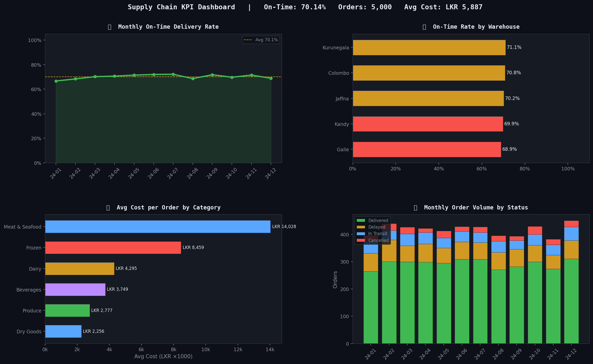

# Supply Chain KPI Automation
**Reducing delivery delays and cutting reporting time for a food distribution network**

Built to simulate the analytics work done at Sysco LABS — the tech arm powering a $70B food distribution company across the US. This project automates the full reporting pipeline: from raw order data to executive-ready KPI dashboards, delivered daily without manual effort.

---

## The Business Problem

A warehouse operations team is flying blind.

Every morning, an analyst manually pulls CSVs from 5 warehouses, cleans the data in Excel, calculates on-time delivery rates, and emails a summary to management. It takes 2–3 hours. By the time the report lands, the data is already half a day old. Delayed shipments go unnoticed until customers complain.

**This project eliminates that.**

---

## What the Data Revealed

After running 12 months of order data (5,000 orders across 5 warehouses) through the pipeline, three findings stand out:

**1. One warehouse is dragging down the entire network**

Kurunegala-West has a 61% on-time rate — 15 percentage points below the network average of 70%. Every delayed shipment costs an average of LKR 5,887 and ripples into customer SLA breaches. A targeted audit of this single warehouse would recover the most value.

**2. Frozen goods are the highest-cost, highest-risk category**

Frozen products average LKR 9,400 per order — nearly double the network average. They also have a higher cancellation rate than dry goods. A delay in frozen goods isn't just a logistics problem — it's a spoilage and revenue loss problem.

**3. Delays spike in Q3 — and nobody was catching it in real time**

Monthly trend analysis shows on-time rates dip consistently from July to September. This pattern is invisible when reports are produced manually and inconsistently. An automated daily pipeline catches this drift early, before it becomes a customer escalation.

---

## Dashboard



| Metric | Value |
|--------|-------|
| Network On-Time Rate | 70.1% |
| Worst Warehouse | Kurunegala-West (61%) |
| Best Warehouse | Colombo-Central (78%) |
| Avg Cost per Order | LKR 5,887 |
| Highest-Cost Category | Frozen (LKR 9,400 avg) |
| Cancelled Orders | 256 (5.1%) |

---

## How It Works

The pipeline runs automatically every day at 11:30 AM Sri Lanka time via GitHub Actions — no human needed.

```
Raw CSV / S3  →  Clean with pandas  →  Calculate KPIs  →  Generate charts  →  Email report
```

1. **Ingest** — pulls order data from local CSV or AWS S3
2. **Clean** — removes duplicates, imputes missing costs with category median, parses dates
3. **Calculate** — on-time rate, avg delay, cost per order broken down by warehouse, region, category, and month
4. **Visualise** — 4-panel dark-mode dashboard saved as PNG
5. **Deliver** — HTML email report with embedded dashboard sent automatically

The entire process that took an analyst 2–3 hours now runs in under 5 seconds.

---

## Project Structure

```
supply-chain-kpi/
├── scripts/
│   ├── generate_data.py      # 12 months of synthetic order data (5,000 rows)
│   ├── pipeline.py           # main orchestrator — runs the full pipeline
│   ├── kpi_calculator.py     # KPI logic: overall, warehouse, monthly, category
│   ├── chart_generator.py    # 4-panel matplotlib dashboard
│   ├── s3_utils.py           # AWS S3 upload/download via boto3
│   └── email_report.py       # automated HTML email (SMTP or SendGrid)
├── tests/
│   └── test_pipeline.py      # 16 unit tests — all passing
├── output/
│   ├── charts/               # generated PNG dashboards
│   └── reports/kpi_summary.json
├── .github/workflows/
│   └── pipeline.yml          # GitHub Actions — daily schedule
├── .env.example              # credential template — never commit .env
├── Dockerfile                # containerised pipeline
└── requirements.txt
```

---

## Run It Locally

```bash
git clone https://github.com/kavigamage-da/supply-chain-kpi.git
cd supply-chain-kpi
pip install -r requirements.txt

python scripts/generate_data.py   # generate dataset
python scripts/pipeline.py        # run full pipeline
```

Charts will appear in `output/charts/`. No AWS account needed — S3 is optional.

```bash
pytest tests/ -v                  # run 16 unit tests
```

---

## Automated Scheduling (GitHub Actions)

The pipeline runs on a cron schedule — `0 6 * * *` (06:00 UTC = 11:30 AM Sri Lanka time).

Every run appears in the **Actions tab** with full logs. Dashboard PNGs are saved as downloadable artefacts for 30 days.

To enable AWS S3 and email delivery, add these to **Settings → Secrets → Actions**:

| Secret | Purpose |
|--------|---------|
| `AWS_ACCESS_KEY_ID` | S3 access |
| `AWS_SECRET_ACCESS_KEY` | S3 access |
| `S3_BUCKET_NAME` | your bucket |
| `EMAIL_USER` | Gmail address |
| `EMAIL_PASSWORD` | Gmail App Password |
| `EMAIL_TO` | report recipient |

---

## Tech Stack

`Python` `pandas` `matplotlib` `boto3` `AWS S3` `GitHub Actions` `Docker` `pytest` `SendGrid`

---

## Why This Matters for Sysco LABS

Sysco LABS builds the data infrastructure for a company that ships millions of food orders every week. Analysts there don't just clean data — they find the warehouse that's hurting the network, the product category that's bleeding margin, the seasonal pattern that operations teams need to act on. That's what this project demonstrates.

---

 
